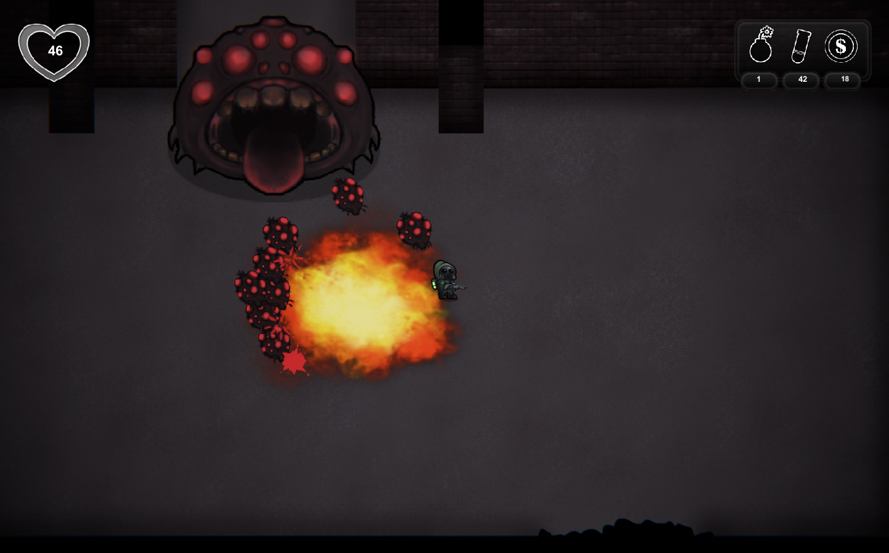
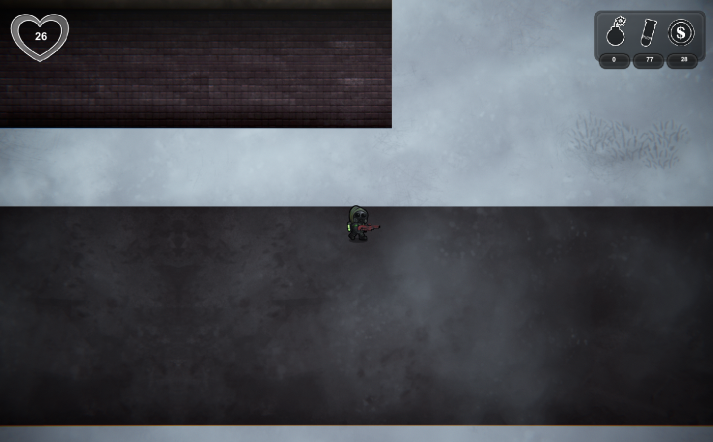

# Blight
2D shooter  
It was originally suppose to become a doughnut collecting game but ended up making it a post-apocalyptic game.

I worked on this project alone and it was one of my first bigger project I worked on when I started to focus on coding. I learned a lot along the way and got a better understanding on how scripts work.

Video of the game  
(https://youtu.be/zlDN7_2YvW4)

Game Images  

 
 
Early Images
 

Player from early stage to final  

Enemy  

